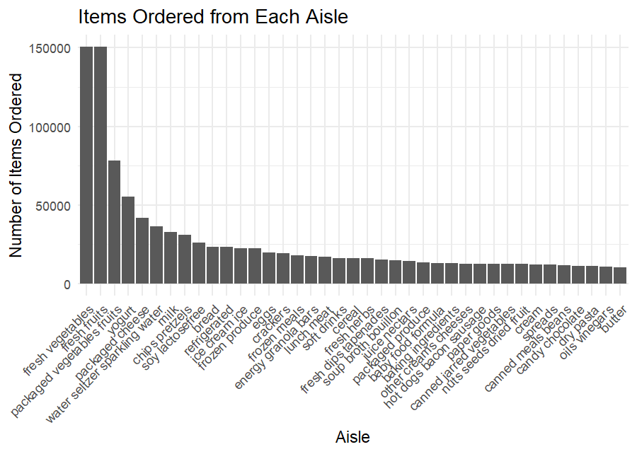
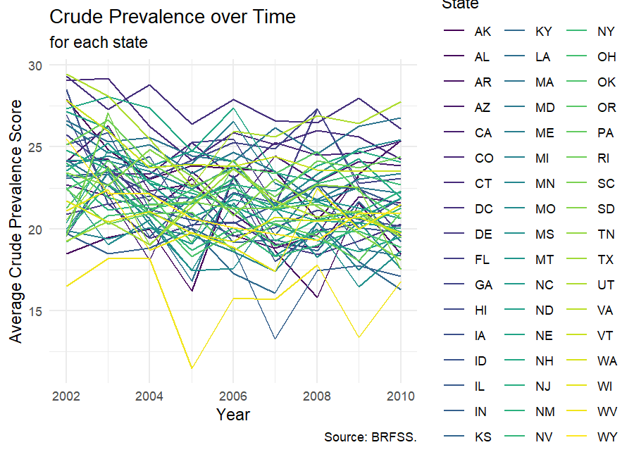
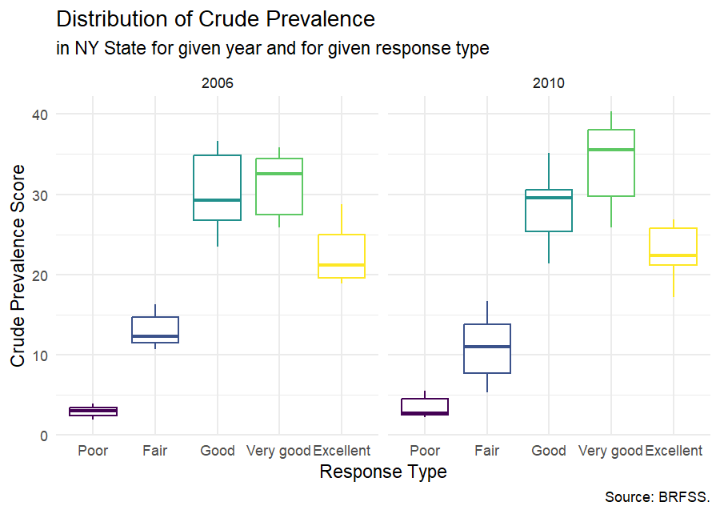
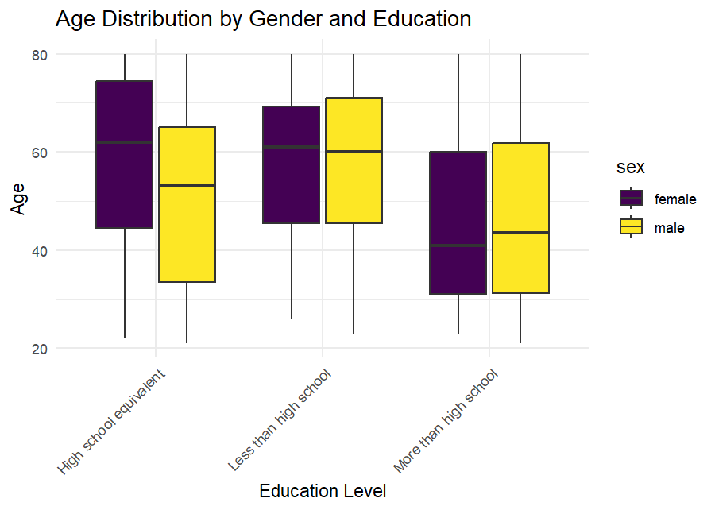
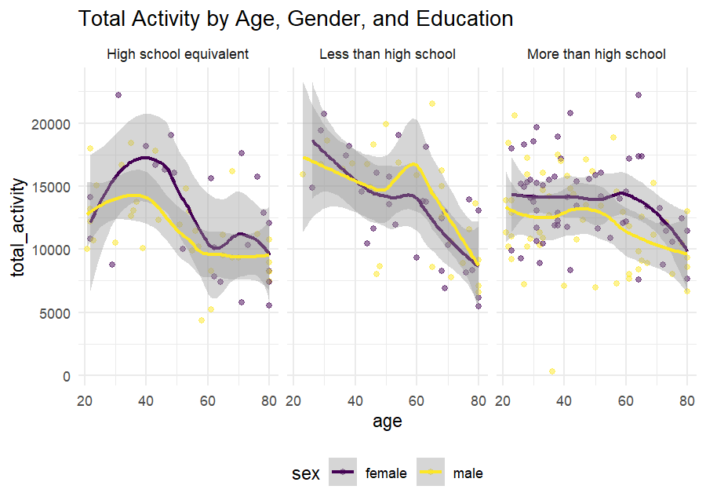
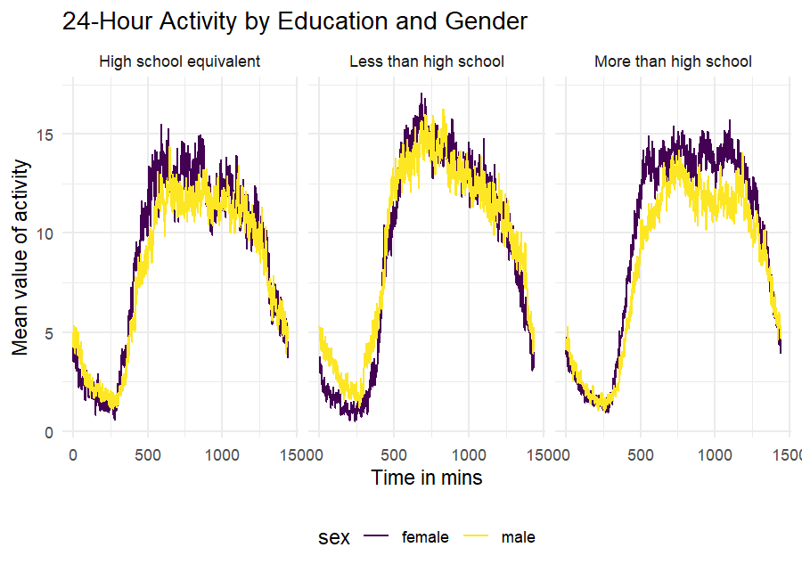

P8105: Data Science I
================
Assignment 3<br>Zhuodiao Kuang (UNI: zk2275)

- [Problem 1](#problem-1)
- [Problem 2](#problem-2)
- [Problem 3](#problem-3)

### Problem 1

``` r
total_aisles <- instacart|> pull(aisle)|>unique()|>length()
popular_aisles <- instacart |>
  group_by(aisle) |>
  summarise(item_count = n()) |>
  arrange(-item_count) # descending order
```

There are total of 134 aisles in this dataset, and “fresh vegetables”
aisle is the most items ordered from.

``` r
filtered_aisles <- instacart |>
  group_by(aisle) |>
  summarise(item_count = n()) |>
  filter(item_count > 10000) |> #limiting this to aisles with more than 10000 items ordered
  arrange(item_count)
filtered_aisles |> ggplot(aes(x = reorder(aisle, -item_count, FUN=mean), y = item_count)) +
  geom_col() +
  theme(axis.text.x = element_text(angle = 45, hjust = 1)) +
  labs(title = "Items Ordered from Each Aisle",
       x = "Aisle",
       y = "Number of Items Ordered")
```



This plot displays the number of items ordered in each aisle that with
more than 10000 items ordered, among all, fresh fruits and fresh
vegetables have the most orders.

``` r
instacart |> 
  filter(aisle %in% c("baking ingredients", "dog food care", "packaged vegetables fruits")) |> 
  count(aisle, product_name, sort = T) |> 
  group_by(aisle) |> 
  top_n(3) |> # top 3 products within each group
  kable()
```

<table>
<thead>
<tr>
<th style="text-align:left;">
aisle
</th>
<th style="text-align:left;">
product_name
</th>
<th style="text-align:right;">
n
</th>
</tr>
</thead>
<tbody>
<tr>
<td style="text-align:left;">
packaged vegetables fruits
</td>
<td style="text-align:left;">
Organic Baby Spinach
</td>
<td style="text-align:right;">
9784
</td>
</tr>
<tr>
<td style="text-align:left;">
packaged vegetables fruits
</td>
<td style="text-align:left;">
Organic Raspberries
</td>
<td style="text-align:right;">
5546
</td>
</tr>
<tr>
<td style="text-align:left;">
packaged vegetables fruits
</td>
<td style="text-align:left;">
Organic Blueberries
</td>
<td style="text-align:right;">
4966
</td>
</tr>
<tr>
<td style="text-align:left;">
baking ingredients
</td>
<td style="text-align:left;">
Light Brown Sugar
</td>
<td style="text-align:right;">
499
</td>
</tr>
<tr>
<td style="text-align:left;">
baking ingredients
</td>
<td style="text-align:left;">
Pure Baking Soda
</td>
<td style="text-align:right;">
387
</td>
</tr>
<tr>
<td style="text-align:left;">
baking ingredients
</td>
<td style="text-align:left;">
Cane Sugar
</td>
<td style="text-align:right;">
336
</td>
</tr>
<tr>
<td style="text-align:left;">
dog food care
</td>
<td style="text-align:left;">
Snack Sticks Chicken & Rice Recipe Dog Treats
</td>
<td style="text-align:right;">
30
</td>
</tr>
<tr>
<td style="text-align:left;">
dog food care
</td>
<td style="text-align:left;">
Organix Chicken & Brown Rice Recipe
</td>
<td style="text-align:right;">
28
</td>
</tr>
<tr>
<td style="text-align:left;">
dog food care
</td>
<td style="text-align:left;">
Small Dog Biscuits
</td>
<td style="text-align:right;">
26
</td>
</tr>
</tbody>
</table>

This table shows the the number of times each item is ordered in three
most popular items from three aisles (“baking ingredients”, “dog food
care”, and “packaged vegetables fruits”).

``` r
instacart |> 
  filter(product_name %in% c("Pink Lady Apples", "Coffee Ice Cream")) |> 
  group_by(product_name,order_dow) |> 
  summarise(mean_hour = mean(order_hour_of_day))|>  # 3 cols we focus on
  pivot_wider(
    names_from = product_name,
    values_from = mean_hour
  ) |> 
  mutate(order_dow = factor(order_dow,
                            labels = c("Sunday", "Monday", "Tuesday", "Wednesday", "Thursday", "Friday", "Saturday")))|> 
  kable(format = "markdown", 
        col.names = c("Day of Week", "Pink Lady Apples (Mean Hour)", "Coffee Ice Cream (Mean Hour)"),
        caption  = "Mean Order Hour for Selected Items") 
```

| Day of Week | Pink Lady Apples (Mean Hour) | Coffee Ice Cream (Mean Hour) |
|:------------|-----------------------------:|-----------------------------:|
| Sunday      |                     13.77419 |                     13.44118 |
| Monday      |                     14.31579 |                     11.36000 |
| Tuesday     |                     15.38095 |                     11.70213 |
| Wednesday   |                     15.31818 |                     14.25000 |
| Thursday    |                     15.21739 |                     11.55172 |
| Friday      |                     12.26316 |                     12.78431 |
| Saturday    |                     13.83333 |                     11.93750 |

Mean Order Hour for Selected Items

This table shows the mean hour of the day at which Pink Lady Apples and
Coffee Ice Cream are ordered throughout a week.

### Problem 2

``` r
library(p8105.datasets)
data("brfss_smart2010")
```

First, do some data cleaning:

``` r
cleaned_brfss <- brfss_smart2010 |>
  janitor::clean_names() |>
  rename(State = locationabbr)|>
  filter(
    topic == "Overall Health", 
    response %in% c("Excellent", "Very good", "Good", "Fair", "Poor")
    ) |>
  mutate(
    response = factor(response, levels = c("Poor", "Fair", "Good", "Very good", "Excellent"))
  )
```

``` r
states_observed <- cleaned_brfss |>
  group_by(year, State) |>
  summarise(Locations_Count = n_distinct(locationdesc), .groups = "drop") |>
  filter(Locations_Count >= 7)|>
  arrange(desc(Locations_Count))

# In 2002
states_2002 <- states_observed |> filter(year == 2002) |>select(State,Locations_Count)
kable(states_2002,booktabs = TRUE,
      caption  = "States that observed at 7 or more locations in 2002")|>
  kable_styling(position = "center",full_width = F)
```

<table class="table" style="width: auto !important; margin-left: auto; margin-right: auto;">
<caption>
States that observed at 7 or more locations in 2002
</caption>
<thead>
<tr>
<th style="text-align:left;">
State
</th>
<th style="text-align:right;">
Locations_Count
</th>
</tr>
</thead>
<tbody>
<tr>
<td style="text-align:left;">
PA
</td>
<td style="text-align:right;">
10
</td>
</tr>
<tr>
<td style="text-align:left;">
MA
</td>
<td style="text-align:right;">
8
</td>
</tr>
<tr>
<td style="text-align:left;">
NJ
</td>
<td style="text-align:right;">
8
</td>
</tr>
<tr>
<td style="text-align:left;">
CT
</td>
<td style="text-align:right;">
7
</td>
</tr>
<tr>
<td style="text-align:left;">
FL
</td>
<td style="text-align:right;">
7
</td>
</tr>
<tr>
<td style="text-align:left;">
NC
</td>
<td style="text-align:right;">
7
</td>
</tr>
</tbody>
</table>

``` r
# In 2010
states_2010 <- states_observed |> filter(year == 2010) |>select(State,Locations_Count)
kable(states_2010, booktabs=TRUE,
      caption  = "States that observed at 7 or more locations in 2010")|>
  kable_styling(position = "center",full_width = F)
```

<table class="table" style="width: auto !important; margin-left: auto; margin-right: auto;">
<caption>
States that observed at 7 or more locations in 2010
</caption>
<thead>
<tr>
<th style="text-align:left;">
State
</th>
<th style="text-align:right;">
Locations_Count
</th>
</tr>
</thead>
<tbody>
<tr>
<td style="text-align:left;">
FL
</td>
<td style="text-align:right;">
41
</td>
</tr>
<tr>
<td style="text-align:left;">
NJ
</td>
<td style="text-align:right;">
19
</td>
</tr>
<tr>
<td style="text-align:left;">
TX
</td>
<td style="text-align:right;">
16
</td>
</tr>
<tr>
<td style="text-align:left;">
CA
</td>
<td style="text-align:right;">
12
</td>
</tr>
<tr>
<td style="text-align:left;">
MD
</td>
<td style="text-align:right;">
12
</td>
</tr>
<tr>
<td style="text-align:left;">
NC
</td>
<td style="text-align:right;">
12
</td>
</tr>
<tr>
<td style="text-align:left;">
NE
</td>
<td style="text-align:right;">
10
</td>
</tr>
<tr>
<td style="text-align:left;">
WA
</td>
<td style="text-align:right;">
10
</td>
</tr>
<tr>
<td style="text-align:left;">
MA
</td>
<td style="text-align:right;">
9
</td>
</tr>
<tr>
<td style="text-align:left;">
NY
</td>
<td style="text-align:right;">
9
</td>
</tr>
<tr>
<td style="text-align:left;">
OH
</td>
<td style="text-align:right;">
8
</td>
</tr>
<tr>
<td style="text-align:left;">
CO
</td>
<td style="text-align:right;">
7
</td>
</tr>
<tr>
<td style="text-align:left;">
PA
</td>
<td style="text-align:right;">
7
</td>
</tr>
<tr>
<td style="text-align:left;">
SC
</td>
<td style="text-align:right;">
7
</td>
</tr>
</tbody>
</table>

In 2002, PA, MA, NJ, CT, FL, NC (total of 6 states) were observed at 7
or more locations. In 2010, total of 14 states were observed at 7 or
more locations, including FL, NJ, TX, CA, MD, NC, NE, WA, MA, NY, OH,
CO, PA, SC.

``` r
excellent_responses <- cleaned_brfss |>
  filter(response == "Excellent") |>
  group_by(year, State) |>
  summarise(average_value = mean(data_value, na.rm = TRUE), .groups = "drop")

ggplot(excellent_responses, aes(x = year, y = average_value, group = State, color = State)) +
  geom_line() +
  theme_minimal()+ 
  theme(legend.position = "right") +
  # add meta-data
  labs(
      title    = "Crude Prevalence over Time"
    , subtitle = "for each state"
    , x        = "Year"
    , y        = "Average Crude Prevalence Score"
    , caption  = "Source: BRFSS."
  )
```



This “spaghetti” plot contains only “Excellent” responses, years,
states, and the average values across locations within a state.

``` r
cleaned_brfss |>
  filter(State == "NY", year %in% c(2006, 2010))|>
# group by year
  group_by(year) |>
  # instantiate plot
  ggplot(aes(x = response, y = data_value, color = response)) +
  # add box plot
  geom_boxplot() +
  # stratify by year
  facet_grid(~year) + 
  # omit legend
  theme(legend.position = "none") +
  # add meta-data
  labs(
      title    = "Distribution of Crude Prevalence"
    , subtitle = "in NY State for given year and for given response type"
    , x        = "Response Type"
    , y        = "Crude Prevalence Score"
    , caption  = "Source: BRFSS."
  )
```



This two-panel plot shows the distribution of ‘data_value’ for four
levels of responses in years 2006 and year 2010, among locations in NY
State only. Year 2010 has an overall high data values than year 2006 in
all responses.

### Problem 3

``` r
#Load, tidy, merge, organize datasets
covar <- read_csv("nhanes_covar.csv", skip = 4) |>
  janitor::clean_names() |>
  mutate(
      sex = recode(sex, "1" = "male", "2" = "female"),
      education = recode(education, "1" = "Less than high school", "2" = "High school equivalent", "3" = "More than high school")
      ) |>
  mutate(
    sex = factor(sex), 
    education = factor(education)
    )
clean_covar <- covar |>
  filter(age >= 21) |>
  drop_na()
accel <- read_csv("nhanes_accel.csv") |>
  janitor::clean_names() 
merged_data <- merge(clean_covar, accel, by = "seqn")
```

The “merged_data” dataset includes all variables from both ‘accel’ and
‘covar’ which merged by “SEQN” number; no data of participants less than
age of 21; no missing demographic data; and all numeric values changed
to meaningful factors.

``` r
# Table of the number of men and women in each education category
gender_edu <- merged_data |>
  group_by(sex, education) |>
  summarise(count = n(), .groups = "drop") |>
  pivot_wider(names_from = sex, values_from = count)
kable(gender_edu, 
      title = "Number of men and women in each education levels",
      col.names = c("Education Level", "Number of Female", "Number of Male"))
```

<table>
<thead>
<tr>
<th style="text-align:left;">
Education Level
</th>
<th style="text-align:right;">
Number of Female
</th>
<th style="text-align:right;">
Number of Male
</th>
</tr>
</thead>
<tbody>
<tr>
<td style="text-align:left;">
High school equivalent
</td>
<td style="text-align:right;">
23
</td>
<td style="text-align:right;">
35
</td>
</tr>
<tr>
<td style="text-align:left;">
Less than high school
</td>
<td style="text-align:right;">
28
</td>
<td style="text-align:right;">
27
</td>
</tr>
<tr>
<td style="text-align:left;">
More than high school
</td>
<td style="text-align:right;">
59
</td>
<td style="text-align:right;">
56
</td>
</tr>
</tbody>
</table>

``` r
# Visualization of Age Distribution
ggplot(merged_data, aes(x = education, y = age, fill = sex)) +
  geom_boxplot() +
  labs(title = "Age Distribution by Gender and Education",
       x = "Education Level",
       y = "Age") +
  theme_minimal() +
  theme(axis.text.x = element_text(angle = 45, hjust = 1))
```



The table shows there are more female in the higher education group,
more male have a high school equivalent background. This box-plot shows
the age distribution of men and women in three different education
levels. As a result, younger people appear to have a higher education
level (more than high school), the middle age group have relevant lower
education.

``` r
new_merged <- merged_data |>
  mutate(
    total_activity = rowSums(across(min1:min1440), na.rm = TRUE)
    )
ggplot(new_merged, aes(x = age, y = total_activity, color = sex)) +
  geom_point(alpha = .5) +
  facet_wrap(~education) +
  geom_smooth() +
  labs(title = "Total Activity by Age, Gender, and Education")
```



The y-axis in this panel plot represents the overall activities, and the
x-axis represents the ages. In order to compare men and women and their
activities, it divides into three subplots based on educational
attainment. Consequently, there is a direct correlation between
activities and age; individuals who are older (over 60) tend to be less
active. There seems to be more activity and a gentler line in the group
with higher education levels.

``` r
activity_data <- merged_data |>
  group_by(education, sex)|>
  summarise(across(starts_with("min"), ~ mean(.), .names = "mean_{.col}"), .groups = "drop") |>
  pivot_longer(cols = starts_with("mean_"), names_to = "time", values_to = "mean")|>
  mutate(
    time = substring(time, 9),
    time = as.numeric(time)
  )
ggplot(activity_data, aes(x = time, y = mean, color = sex)) +
  geom_line() +
  facet_grid(. ~education) +
  labs(title = "24-Hour Activity by Education and Gender", 
       x = "Time in mins",
       y = "Mean value of activity")
```



The 24-hour activity time courses for three educational levels are
displayed in this three-panel figure, along with a gender correlation
analysis. Because of this, the “less than high school” group has a
notably greater mean value of activity than the other education level
groups, and female tends to have higher activity score than male except
for the “High school equivalent” education level.
